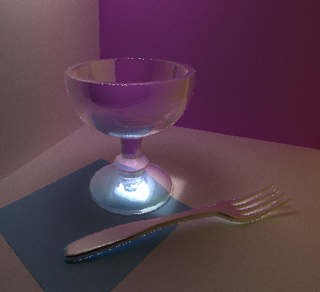
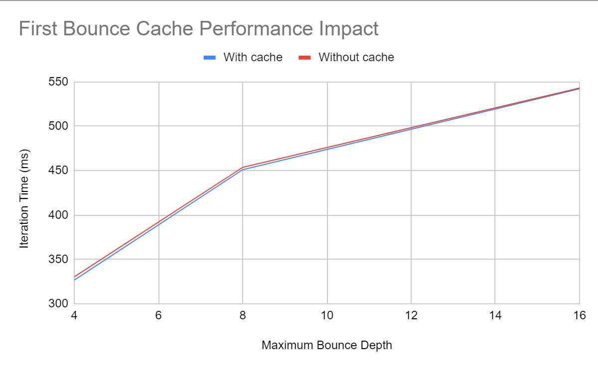
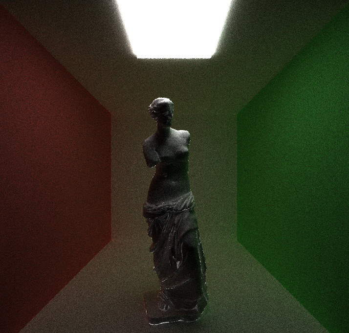
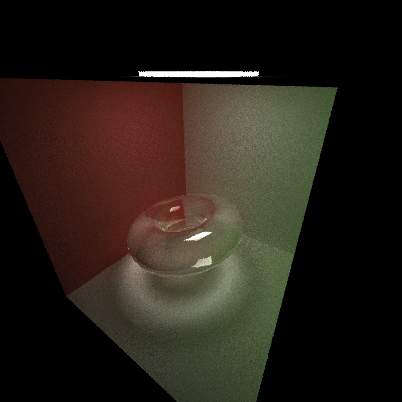
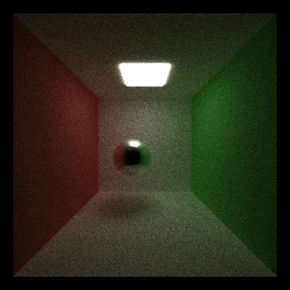

CUDA Path Tracer
================

**University of Pennsylvania, CIS 565: GPU Programming and Architecture, Project 3**

* Joshua Nadel
  * https://www.linkedin.com/in/joshua-nadel-379382136/, http://www.joshnadel.com/
* Tested on: Windows 10, i7-6700HQ @ 2.60GHz 16GB, GTX 970M (Personal laptop)

### Path Tracer

A parallelized pathtracer to realistically render 3D information. This implementation supports arbitrary mesh loading, refractive and reflective surfaces, and microfaceted specular surfaces.

All iteration runtimes were timed on the GPU over 60 iterations with a max ray depth of 8, then averaged. For comparison, a default, all-diffuse cornell box featuring a single sphere takes on average 451.021ms per iteration.

### Optimizations

*Memory Contiguity:* This optimization sorts intersections and path segments before shader evaluation by the material of the surface they hit. This makes it more likely for intersections of the same material to be processed by the same block. Because certain shader models take less time than others to evaluate, blocks evaluating solely these faster shaders won't have to wait for slower ones to finish computing before completing warps and moving on to the next warp. It maximizes the number of threads being used at a given time. However, it seems the scenes I am working with are not complex enough for this optimization to be beneficial. Without this optimization, the average iteration time of a cornell box with a reflective sphere decreases from 450.439ms to 75.0013ms. The cost of sorting the rays is more expensive than the benefits of contiguous material memory.

*First Bounce Cache:* The first bounce of the pathtracer is deterministic across iterations (assuming no pixel-jitter for anti-aliasing). So, this bounce only needs to be computed once during the first iteration and can be reused later to save time. Without this optimization, a diffuse-only cornell box scene takes on average 453.705ms per iteration. As stated earlier, the same scene takes on average 451.021ms per iteration with this optimization. When the max ray depth is increased from 8 to 16, average iteration time without this optimization is 543.071ms, but only 542.196ms with this optimization. When the max ray depth is decreased from 8 to 4, average iteration time without this optimization is 330.374ms, but only 326.77ms with this optimization. This relationship is visualized in this figure:

The iteration times with and without the cache converge. So, as max bounce depth increases, the impact of this optimization lessens.

*Stream Compaction:* Stream compaction allows the pathtracer to eliminate dead rays from computation in parallel. This figure displays the number of rays remaining alive after each bounce.

As such, performance improves with stream compaction. Without it, a diffuse-only cornell box takes 920.743ms per iteration: more than twice the render time with stream compaction.

Enclosing the cornell box with a fourth wall and moving the camera inside the box results in a render time of 886.059ms with stream compaction on and 936.193ms with stream compaction off. With the wall removed, rays are able to escape the scene into the void where they can die and be removed, so stream compaction is better able to optimize rendering; 610.097ms with stream compaction on and 926.65ms with it off. This relationship is depicted in this chart:

Stream compaction is better able to optimize iteration times in scenes where rays can escape the scene.

### Mesh Loading

The pathtracer is able to load in any obj mesh file. It parses the mesh into triangles which it compares intersections with independently before choosing the closest one. Out of curiousity, I compared rendering a primitive cube against rendering a mesh-defined cube. The primitive cube took 446.066ms on average each iteration, while the mesh-defined cube took 450.803ms.

The mesh intersection test includes an optimization in which it first tests for intersection with bounding box surrounding the mesh. This test is much faster than testing against every triangle, so in cases where the ray misses the mesh, the bounding box check can save a lot of time. The "glass" mesh takes 1586.55ms to render without a bounding box check, but only 1579.45ms with one.

### Refraction

By refracting incoming rays according to indices of refraction, the pathtracer is able to achieve glass or water-like transmissive materials. A cornell box with a transmissive sphere with an ior of 1.54 takes 459.021ms to render each iteration.

### Imperfect Specular

Instead of reflecting rays perfectly across the normal or distributing them equally in a hemisphere, microfacetted materials bounce rays in a lobe-shaped distribution. This distribution is between the two extremes; rays can be bounced in any direction, but are increasingly more likely to be bounced similarly to perfect reflection. How much more likely depends on the specular exponent defined by the material. A cornell box with an imperfect specular sphere with an exponent of 0.8 takes 454.336ms to render.